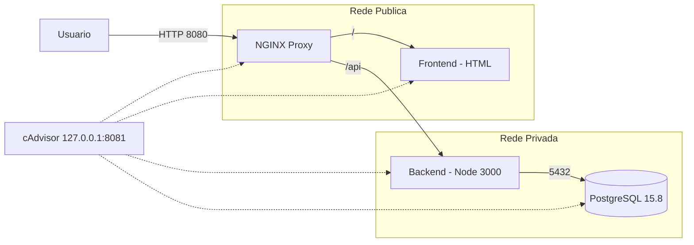
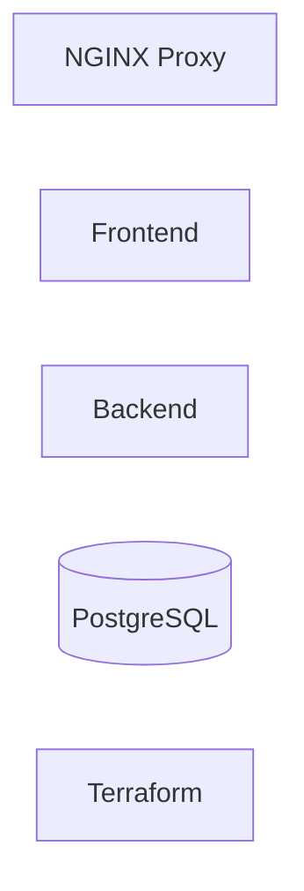

# Desafio Técnico - CubeDevOps

## 🎯 Objetivo do Desafio

Demonstrar boas práticas de containerização, isolamento de rede, infraestrutura como código e validação de ambiente.

## 📌 Visão Geral

Este projeto implementa um ambiente seguro, isolado e replicável utilizando **Docker** e **Terraform**, contendo:

- Frontend (HTML estático)
- Backend (Node.js)
- Banco de Dados (PostgreSQL 15.8)
- Proxy Reverso (NGINX)
- Orquestração via Terraform utilizando Docker

Todos os componentes executam **localmente via contêineres Docker**

## 🏆 Considerações Arquiteturais

- Credenciais fornecidas exclusivamente via variáveis de ambiente (TF_VAR_*), sem qualquer senha ou usuário hardcoded no código ou versionado no Terraform.
- Arquivos sensíveis (.env, terraform.tfvars, *.tfstate) explicitamente ignorados no .gitignore.
- Banco de dados e Backend não expostos ao host, acessíveis apenas através da rede Docker interna (internal = true).
- Único ponto de entrada público: NGINX (porta 8080), atuando como proxy reverso e camada de isolamento.
- Observabilidade restrita ao localhost: cAdvisor exposto somente em 127.0.0.1:8081.
- Infraestrutura declarativa e idempotente via Terraform, permitindo reprovisionamento consistente do ambiente.
- Separação clara de responsabilidades entre camadas (Proxy, Aplicação, Dados e Observabilidade), reduzindo acoplamento e ampliando segurança.

---

## 🧩 Diagrama de Arquitetura




## 🧠 Mapa Interativo dos Recursos




## 🔐 Redes

- **Rede pública**
  - Acesso externo permitido
  - Containers: `proxy`, `frontend`

- **Rede privada**
  - Comunicação interna isolada
  - Containers: `backend`, `db`, `proxy`
  - Não exposta ao host


## 🔁 Fluxo da Aplicação

Usuario → NGINX (porta 8080)

- `/` → Frontend
- `/api` → Backend → PostgreSQL


## 🧱 Componentes

### Frontend
- HTML estático
- Servido via container Docker
- Acessível apenas através do Proxy

### Backend
- Aplicação Node.js
- Recebe requisições via `/api`
- Conecta ao PostgreSQL via variáveis de ambiente
- Retorna status da conexão e validação de usuário admin

### PostgreSQL 15.8
- Inicializado com script SQL (`sql/script.sql`)
- Dados persistidos via volume Docker
- Healthcheck configurado (`pg_isready`)

### NGINX
- Proxy reverso
- Expõe apenas a porta 8080
- Backend e Banco de Dados não são acessíveis diretamente

### Terraform
- Provisiona redes, volumes, imagens e containers
- Define variáveis de ambiente
- Configura restart automático
- Garante isolamento de rede


## 📂 Estrutura do Projeto

```
.
├── README.md
├── backend
│   ├── Dockerfile
│   ├── index.js
│   └── package.json
├── frontend
│   ├── Dockerfile
│   └── index.html
├── infra
│   ├── main.tf
│   ├── outputs.tf
│   ├── terraform.tfvars
│   ├── terraform.tfvars.example
│   ├── variables.tf
│   └── versions.tf
├── proxy
│   └── nginx.conf
├── sql
│   └── script.sql
```


## ⚙️ Pré-requisitos

- Docker (Engine ou Docker Desktop)
- Terraform >= 1.5
- Sistema operacional compatível com Docker


## 🚀 Inicialização

```bash
cd infra
terraform init
terraform validate
terraform apply -auto-approve
```


## 🔎 Testes e Validações

Abaixo estão os testes recomendados para validar funcionamento,
isolamento e observabilidade do ambiente.


### 🐳 1. Verificar Containers Ativos

**Comando:**

``` bash
docker ps
```

**Esperado:**

-   desafio-tecnico-proxy → Up
-   desafio-tecnico-frontend → Up
-   desafio-tecnico-backend → Up
-   desafio-tecnico-db → Up (healthy)
-   desafio-tecnico-cadvisor → Up (healthy)


### 🌐 2. Testes Públicos (acessíveis ao usuário)

#### 2.1 Validar Frontend

**Comando:**

``` bash
curl -I http://localhost:8080/ | head -n 5
```

**Esperado:**

    HTTP/1.1 200 OK
    Content-Type: text/html

Ou acessar no navegador:

    http://localhost:8080


#### 2.2 Validar API via Proxy

**Comando:**

``` bash
curl -s http://localhost:8080/api | jq
```

**Esperado:**

``` json
{
  "database": true,
  "userAdmin": true
}
```

Valida o fluxo completo:

Usuário → NGINX → Backend → PostgreSQL


### 🔐 3. Testes de Isolamento (Segurança de Rede)

#### Backend NÃO exposto publicamente

**Comando:**

``` bash
docker port desafio-tecnico-backend
```

**Esperado:**

Sem saída (nenhuma porta publicada).


#### Banco de Dados NÃO exposto publicamente

**Comando:**

``` bash
docker port desafio-tecnico-db
```

**Esperado:**

Sem saída (nenhuma porta publicada).


#### Validar rede privada interna

**Comando:**

``` bash
docker network inspect desafio-tecnico_private
```

**Esperado:**

``` json
"Internal": true
```


### 📊 4. Observabilidade (cAdvisor)

#### Validar Health do container

**Comando:**

``` bash
docker inspect desafio-tecnico-cadvisor --format '{{.State.Health.Status}}'
```

**Esperado:**

    healthy


#### Validar endpoint local de métricas

**Comando:**

``` bash
curl -I http://127.0.0.1:8081/containers/ | head -n 5
```

**Esperado:**

    HTTP/1.1 200 OK

Observação:

-   cAdvisor está exposto apenas em `127.0.0.1`
-   Não há exposição pública de métricas


## ♻️ Reprodutibilidade e Idempotência

O ambiente é recriável e descartável: pode ser destruído e criado novamente a qualquer momento via Terraform.

Recursos de infraestrutura (redes, volume, containers) são gerenciados como código, garantindo consistência entre execuções.

**Comandos:**

``` bash
cd infra
terraform apply -auto-approve
```

**Para remover tudo:**

``` bash
cd infra
terraform destroy -auto-approve
```

Observação: 

- PostgreSQL utiliza volume persistente. Ao recriar o ambiente sem remover o volume, os dados permanecem; ao criar com volume novo, o script **sql/script.sql** é executado no primeiro boot.


## 🏷️ Release

Entrega publicada na release **v1.0.0**
