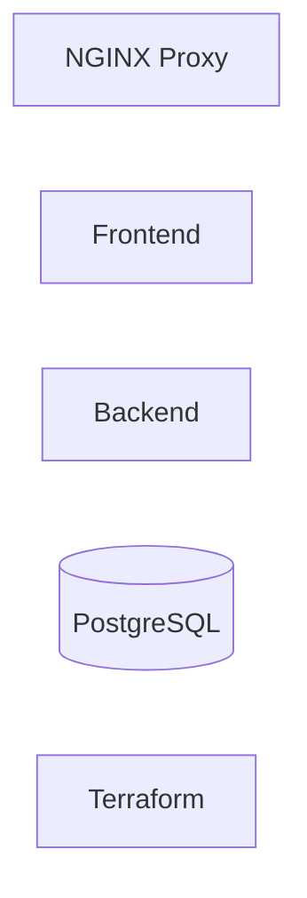

# Desafio Técnico - CubeDevOps

## 🎯 Objetivo do Desafio

Demonstrar boas práticas de containerização, isolamento de rede, infraestrutura como código e validação de ambientes, com foco em segurança, reprodutibilidade e clareza arquitetural.

## 📌 Visão Geral

Este projeto implementa um ambiente seguro, isolado e replicável utilizando **Docker** e **Terraform**, contendo:

- Frontend (HTML estático)
- Backend (Node.js)
- Banco de Dados (PostgreSQL 15.8)
- Proxy Reverso (NGINX)
- Orquestração via Terraform utilizando Docker

Todos os componentes executam localmente em contêineres **Docker**, com provisionamento e orquestração realizados via **Terraform**.

## 🏆 Considerações Arquiteturais

- Credenciais fornecidas exclusivamente via variáveis de ambiente (TF_VAR_*) ou arquivo local terraform.tfvars, sem qualquer senha ou usuário hardcoded no código ou versionado no repositório.
- Arquivos sensíveis (.env, terraform.tfvars, *.tfstate) explicitamente ignorados no .gitignore.
- Banco de dados e Backend não são expostos ao host, sendo acessíveis apenas pela rede Docker interna (internal = true).
- Único ponto de entrada público: NGINX (porta 8080), atuando como proxy reverso e camada de isolamento.
- Observabilidade restrita ao localhost: cAdvisor exposto somente em 127.0.0.1:8081.
- Infraestrutura declarativa e idempotente via Terraform, permitindo reprovisionamento consistente do ambiente.
- Separação clara de responsabilidades entre camadas (Proxy, Aplicação, Dados e Observabilidade), reduzindo acoplamento e ampliando a segurança do ambiente.

---

## 🧩 Diagrama de Arquitetura


O diagrama abaixo representa o fluxo de comunicação, isolamento de redes e pontos de exposição do ambiente.


## 🧠 Mapa Interativo dos Recursos




## 🔐 Redes

- **Rede pública**
  - Acesso externo permitido
  - Containers: `proxy`, `frontend`

- **Rede privada**
  - Comunicação interna isolada entre serviços
  - Containers: `backend`, `db`, `proxy`
  - Rede não exposta diretamente ao host


## 🔁 Fluxo da Aplicação

Usuário → NGINX (porta 8080)

- `/` → Frontend
- `/api` → Backend → PostgreSQL


## 🧱 Componentes

### Frontend
- HTML estático
- Servido via container Docker
- Acessível apenas através do Proxy

### Backend
- Aplicação Node.js
- Recebe requisições via `/api`
- Conecta ao PostgreSQL via variáveis de ambiente
- Retorna status da conexão e validação de usuário admin

### PostgreSQL 15.8
- Inicializado com script SQL (`sql/script.sql`)
- Dados persistidos via volume Docker
- Healthcheck configurado (`pg_isready`)

### NGINX
- Proxy reverso
- Expõe apenas a porta 8080
- Backend e Banco de Dados não são acessíveis diretamente

### Terraform
- Provisiona redes, volumes, imagens e containers
- Define variáveis de ambiente
- Configura restart automático
- Garante isolamento de rede e comportamento idempotente nas execuções


## 📂 Estrutura do Projeto

```
.
├── backend
│   ├── Dockerfile
│   ├── index.js
│   └── package.json
├── frontend
│   ├── Dockerfile
│   └── index.html
├── infra
│   ├── terraform.lock.hcl
│   ├── main.tf
│   ├── outputs.tf
│   ├── terraform.tfvars.example
│   ├── variables.tf
│   └── versions.tf
├── proxy
│   └── nginx.conf
├── sql
│   └── script.sql
├── .env.example
├── .gitignore
├── README.md
```


## ⚙️ Pré-requisitos

- Docker (Engine ou Docker Desktop)
- Terraform >= 1.5
- Sistema operacional compatível com Docker

## 🔐 Configuração de Variáveis

Você pode configurar o ambiente de duas formas:

- Utilizando terraform.tfvars (mais direto)
- Utilizando .env com variáveis TF_VAR_*

Escolha apenas uma das opções.

Essa abordagem evita ambiguidade de configuração e garante previsibilidade durante o provisionamento.

- Antes de executar o provisionamento, copie o arquivo de exemplo:

```bash
cd infra
cp terraform.tfvars.example terraform.tfvars
```

- Em seguida, edite o arquivo terraform.tfvars conforme necessário:

```bash
project_name      = "desafio-tecnico"
proxy_port        = 8080

postgres_db       = "appdb"
postgres_user     = "appuser"
postgres_password = "changeme"

cadvisor_port     = 8081
```


⚠️ O arquivo terraform.tfvars não é versionado (está listado no .gitignore) e deve conter apenas valores locais ou de teste.


### 🚀 Inicialização utilizando `terraform`

```bash
cd infra
terraform init
terraform validate
terraform apply -auto-approve
```


## 🔁 Alternativa: Utilizando arquivo `.env` (variáveis de ambiente)

Opcionalmente, é possível definir as variáveis utilizando um arquivo `.env` na raiz do projeto, seguindo o padrão TF_VAR_* do **Terraform**.

- Crie o arquivo a partir do exemplo:

```bash
cp .env.example .env
```


### 🚀 Inicialização utilizando `.env`

```bash
cd infra

set -a
source ../.env
set +a

terraform init
terraform validate
terraform apply -auto-approve
```


## 🔎 Testes e Validações

Os comandos abaixo validam três aspectos principais do ambiente: o funcionamento ponta a ponta do sistema, 
o isolamento de rede está aplicado, e a observabilidade está acessível só localmente.


### 🐳 1. Verificar Containers Ativos

**Comando:**

``` bash
docker ps
```

**Esperado:**

-   desafio-tecnico-proxy → Up
-   desafio-tecnico-frontend → Up
-   desafio-tecnico-backend → Up
-   desafio-tecnico-db → Up (healthy)
-   desafio-tecnico-cadvisor → Up (starting ou healthy)


### 🌐 2. Testes Públicos (acessíveis ao usuário)

#### 2.1 Validar Frontend

**Comando:**

``` bash
curl -I http://localhost:8080/ | head -n 5
```

**Esperado:**

    HTTP/1.1 200 OK
    Content-Type: text/html

Ou acessar no navegador:

    http://localhost:8080


#### 2.2 Validar API via Proxy

**Comando:**

``` bash
curl -s http://localhost:8080/api | jq
```

**Esperado:**

``` json
{
  "database": true,
  "userAdmin": true
}
```

Valida o fluxo completo:

Usuário → NGINX → Backend → PostgreSQL


### 🔐 3. Testes de Isolamento (Segurança de Rede)

#### Backend NÃO exposto Publicamente

**Comando:**

``` bash
docker port desafio-tecnico-backend
```

**Esperado:**

Sem saída (nenhuma porta Publicada).


#### Banco de Dados NÃO exposto Publicamente

**Comando:**

``` bash
docker port desafio-tecnico-db
```

**Esperado:**

Sem saída (nenhuma porta Publicada).


#### Validar rede privada interna

**Comando:**

``` bash
docker network inspect desafio-tecnico_private
```

**Esperado:**

``` json
"Internal": true
```


### 📊 4. Observabilidade (cAdvisor)

#### Validar Health do container

**Comando:**

``` bash
docker inspect desafio-tecnico-cadvisor --format '{{.State.Health.Status}}'
```

**Esperado:**

    healthy


#### Validar endpoint local de métricas

**Comando:**

``` bash
curl -I http://127.0.0.1:8081/containers/ | head -n 5
```

**Esperado:**

    HTTP/1.1 200 OK

Observação:

-   cAdvisor está exposto apenas em `127.0.0.1`
-   Não há exposição pública de métricas


## ♻️ Reprodutibilidade e Idempotência

Este ambiente é totalmente descartável: pode ser provisionado e destruído a qualquer momento.

O Terraform garante consistência entre execuções, evitando drift e configuração manual.

### 🔁 Destruição controlada via Terraform (recomendado)

```bash
cd infra
terraform destroy -auto-approve
```

Esse comando remove:

- Containers
- Redes
- Volumes declarados
- Recursos provisionados via código

### 🧹 Reset operacional forçado (caso necessário)

Em cenários onde o estado esteja inconsistente ou containers tenham sido manipulados manualmente:

```bash
docker rm -f desafio-tecnico-db
docker rm -f desafio-tecnico-backend
docker rm -f desafio-tecnico-frontend
docker rm -f desafio-tecnico-proxy
docker rm -f desafio-tecnico-cadvisor 2>/dev/null || true
docker network rm desafio-tecnico_public 2>/dev/null || true
docker network rm desafio-tecnico_private 2>/dev/null || true
docker volume rm desafio-tecnico_pgdata 2>/dev/null || true
```

Observação: Considerando que sua variável declarada esteja como ``project name = "desafio-tecnico"``

### 🧼 Reset completo do estado Terraform (opcional)

Para simular um ambiente totalmente limpo:

```bash
rm -rf infra/.terraform
rm -f infra/terraform.tfstate
rm -f infra/terraform.tfstate.backup
```

### 🔄 Reprovisionamento

Após qualquer reset, o ambiente pode ser recriado utilizando uma das abordagens abaixo:

**Opção 1 — Utilizando `terraform.tfvars`:**

```bash
cd infra
terraform init
terraform validate
terraform apply -auto-approve
```

**Opção 2 — Utilizando variáveis via `.env`:**

```bash
cp .env.example .env
cd infra

set -a
source ../.env
set +a

terraform init
terraform validate
terraform apply -auto-approve
```


Observação: 

- O PostgreSQL utiliza volume persistente (`desafio-tecnico_pgdata`).
- Se o volume não for removido, os dados existentes serão preservados.
- Ao criar um volume novo, o script `sql/script.sql` é executado automaticamente no primeiro boot do container.

Esses procedimentos permitirão reproduzir o ambiente do zero de forma previsível, reforçando o caráter descartável e controlado da infraestrutura.


## 🏷️ Release

Entrega publicada na release **v1.0.0**, conforme especificação do desafio.